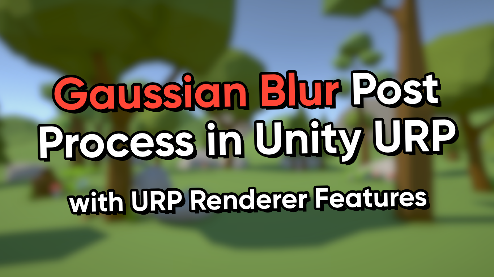

# Gaussian Blur Post Process in Unity 2022 URP

A Gaussian blur post processing effect made with Renderer Features for Unity URP.

## Overview

Gaussian Blur is a useful effect to keep in your arsenal when making games, but Unity doesn't ship with a blur that operates on the whole screen uniformly. This repository contains a two-pass post process blur effect which works with URP's volume system and can be customised to different amounts of blurring. The effect uses URP's code-based Renderer Features to work.

## Software

This project is updated to Unity 2022.3.44f1 (LTS) and URP 14.0.11.

## Tutorials

This project is part of a tutorial which is available in the following places:

- [YouTube](https://www.youtube.com/watch?v=AlCuc58z7E8)
- [Article](https://danielilett.com/2023-06-01-tut6-6-gaussian-blur/)

## Authors

This project and the corresponding tutorials were created by Daniel Ilett and now updated by MrConQueso.

## Release

This project was released on June 1st 2023, and updated as of October 17th 2024.
